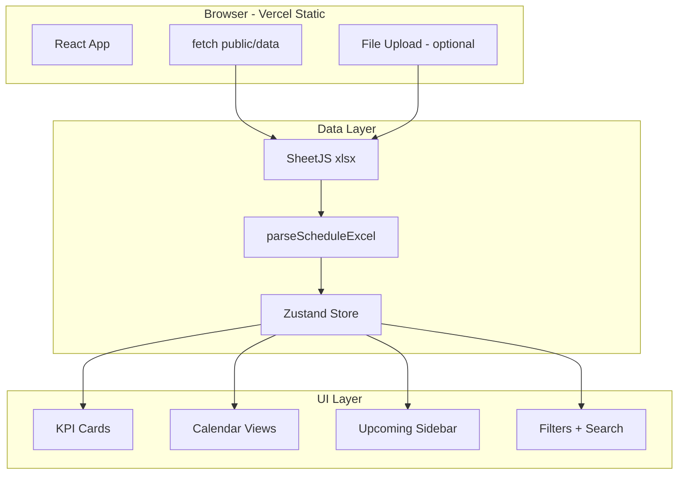

# 골든래빗 일정 대시보드 — 구현 계획

> **데이터 소스:** [`골든래빗 일정.xlsx`](./골든래빗 일정.xlsx)  
> **배포:** Vercel 정적 배포 (팀 공유)  
> **스택:** React 19 + Vite + TypeScript + Tailwind CSS v4 + shadcn/ui + SheetJS

---

## 1. Excel 데이터 분석 결과

### 파일 정보

| 항목 | 값 |
|------|-----|
| 파일명 | `골든래빗 일정.xlsx` |
| 시트 | `시트1` (단일 시트) |
| 데이터 행 | 24건 (헤더 제외) |
| 기간 | 2025-12-01 ~ 2025-12-31 |
| 컬럼 수 | 7 |

### 컬럼 매핑 (실제 헤더 → 앱 모델)

| Excel 컬럼 | 타입 | 앱 필드 | 용도 |
|------------|------|---------|------|
| `날짜` | `datetime` | `date` | 캘린더 배치, 정렬, 필터 |
| `요일` | `string` | `weekday` | 표시용 (날짜에서 재계산 가능) |
| `시간` | `time` 또는 `"종일"` | `time`, `isAllDay` | 타임라인·리스트 시간 표시 |
| `주요 일정/내용` | `string` | `title` | 이벤트 제목, 검색 대상 |
| `담당 부서` | `string` | `department` | 색상 구분, 필터, 범례 |
| `진행 상태 (완료 여부)` | `boolean` | `completed` | 상태 배지 (완료/예정) |
| `비고` | `string \| null` | `note` | 상세 패널, 툴팁 |

### 정규화된 이벤트 타입

```typescript
interface ScheduleEvent {
  id: string;              // date + title 해시
  date: string;            // ISO "2025-12-01"
  weekday: string;         // "월요일"
  time: string | null;     // "10:00" | null (종일)
  isAllDay: boolean;
  title: string;
  department: string;
  completed: boolean;
  note: string | null;
}
```

### 데이터 특이사항 (파서에서 처리)

1. **종일 일정:** `시간` 컬럼 값이 `"종일"` 문자열 (2건: 크리스마스, 연말 대청소)
2. **공휴일:** `담당 부서`가 `"-"` (1건)
3. **완료 상태:** `true` 17건 / `false` 7건
4. **부서 15종:** 인사 총무팀(6), 경영 기획팀(2), 마케팅팀(2), 전 부서(2) 등
5. **요일 컬럼:** Excel에 있으나 `date-fns` `format(date, 'EEEE', { locale: ko })`로 재계산 권장

---

## 2. 디자인 시스템

### 선택: [shadcn/ui](https://ui.shadcn.com) + Tailwind CSS v4

| 이유 | 설명 |
|------|------|
| 일정 UI 생태계 | Calendar, Badge, Tabs, Sheet, Command(검색) 등 즉시 사용 |
| 커스터마이징 | CSS 변수 기반 테마 — 골든래빗 브랜드 색 적용 용이 |
| Vercel 친화 | React + Vite 정적 빌드와 완벽 호환 |
| 접근성 | Radix UI 기반, 키보드·스크린리더 지원 |

### 브랜드 톤 (골든래빗)

- **Primary:** 골드/앰버 계열 (`--primary: oklch(0.75 0.12 85)`)
- **배경:** 밝은 중성 톤 + 다크모드 지원
- **부서별 색상:** 15개 부서에 고정 팔레트 (HSL hue 분배)

### 캘린더 컴포넌트

**1차:** shadcn Calendar + 커스텀 뷰 (월/주/일/아젠다)  
**확장(선택):** [@ilamy/calendar](https://github.com/kcsujeet/ilamy-calendar) — React 19 + Tailwind 4 네이티브, 드래그앤드롭·리소스 뷰

> 24건·단일 월 데이터이므로 **1차는 shadcn 기반 커스텀 뷰**로 충분. 이후 데이터 증가 시 ilamy로 교체 가능.

---

## 3. 일정 중심 UX 설계

### 레이아웃

```
┌─────────────────────────────────────────────────────────────┐
│  헤더: 골든래빗 일정 │ 2025년 12월 │ 검색 │ 뷰 전환 │ 다크모드 │
├──────────┬──────────────────────────────────┬───────────────┤
│ KPI 카드 │         메인 캘린더 영역          │  다가오는 일정 │
│ (4개)    │  [월] [주] [일] [목록] 탭         │  사이드바      │
│          │                                   │  (7일 이내)    │
├──────────┴──────────────────────────────────┴───────────────┤
│  필터: 부서 멀티선택 │ 완료/예정 │ 오늘로 이동              │
└─────────────────────────────────────────────────────────────┘
```

### 핵심 기능

| 기능 | 설명 |
|------|------|
| **월간 뷰** | 날짜 셀에 이벤트 칩(부서 색상), 오늘 하이라이트, 주말 구분 |
| **주간 뷰** | 7일 타임라인, 종일 행 별도 표시 |
| **일간 뷰** | 선택일 상세 타임라인 (09:00~18:00) |
| **목록(아젠다) 뷰** | 날짜순 카드 리스트, 완료/예정 배지 |
| **다가오는 일정** | 오늘 이후 7일, 미완료 우선 정렬 |
| **KPI 카드** | 오늘 일정 수 / 이번 주 / 미완료 / 완료율 |
| **필터** | 부서(15종), 완료 상태, 검색(제목·비고) |
| **상세 Sheet** | 클릭 시 제목·시간·부서·비고·완료 상태 표시 |
| **오늘로 이동** | FAB 또는 헤더 버튼 |

### 일정 보기 편의 포인트

- `종일` 일정은 캘린더 상단 별도 띠(all-day bar)로 표시
- 미완료(`false`) 일정은 점선 테두리 + "예정" 배지
- `전 부서` / 공휴일(`-`)은 특수 아이콘(Users, CalendarOff)
- 모바일: 기본 목록 뷰, 스와이프로 날짜 이동

---

## 4. 기술 아키텍처



### 데이터 로딩 전략 (Vercel)

1. **기본:** `public/data/골든래빗 일정.xlsx` → 앱 시작 시 `fetch` → SheetJS 파싱
2. **선택:** 헤더에 "파일 업로드" → 클라이언트에서만 파싱 (서버 불필요)
3. **캐시:** `localStorage`에 마지막 업로드 세션 저장 (선택)

---

## 5. 프로젝트 구조

```
골든레빗 일정/
├── public/
│   └── data/
│       └── 골든래빗 일정.xlsx      # 배포용 고정 데이터
├── src/
│   ├── main.tsx
│   ├── App.tsx
│   ├── index.css                   # Tailwind v4 + shadcn 토큰
│   ├── components/
│   │   ├── ui/                     # shadcn 컴포넌트
│   │   ├── layout/
│   │   │   ├── AppHeader.tsx
│   │   │   └── AppShell.tsx
│   │   ├── dashboard/
│   │   │   ├── KpiCards.tsx
│   │   │   ├── UpcomingSidebar.tsx
│   │   │   └── DepartmentLegend.tsx
│   │   ├── calendar/
│   │   │   ├── CalendarToolbar.tsx
│   │   │   ├── MonthView.tsx
│   │   │   ├── WeekView.tsx
│   │   │   ├── DayView.tsx
│   │   │   ├── AgendaView.tsx
│   │   │   └── EventChip.tsx
│   │   ├── filters/
│   │   │   ├── DepartmentFilter.tsx
│   │   │   ├── StatusFilter.tsx
│   │   │   └── SearchBar.tsx
│   │   └── events/
│   │       ├── EventDetailSheet.tsx
│   │       └── FileUploadDialog.tsx
│   ├── lib/
│   │   ├── parseExcel.ts           # SheetJS → ScheduleEvent[]
│   │   ├── departmentColors.ts     # 부서별 색상 맵
│   │   ├── dateUtils.ts            # 종일/시간 파싱, 요일
│   │   └── utils.ts
│   ├── store/
│   │   └── scheduleStore.ts        # Zustand
│   └── types/
│       └── schedule.ts
├── index.html
├── package.json
├── vite.config.ts
├── tsconfig.json
├── components.json                 # shadcn
├── vercel.json
└── PLAN.md
```

---

## 6. 구현 단계

### Phase 1 — 프로젝트 셋업 (30분)

- [ ] `npm create vite@latest . -- --template react-ts`
- [ ] Tailwind CSS v4 + shadcn/ui 초기화
- [ ] `xlsx`, `zustand`, `date-fns`, `lucide-react` 설치
- [ ] `골든래빗 일정.xlsx` → `public/data/` 복사

### Phase 2 — 데이터 레이어 (45분)

- [ ] `types/schedule.ts` — `ScheduleEvent` 인터페이스
- [ ] `lib/parseExcel.ts` — 컬럼 매핑, `"종일"` 처리, boolean 변환
- [ ] `lib/departmentColors.ts` — 15개 부서 HSL 팔레트
- [ ] `store/scheduleStore.ts` — 이벤트, 필터, 뷰 모드 상태
- [ ] 단위 테스트: 파서가 24건 정확히 로드하는지 확인

### Phase 3 — 대시보드 UI (2시간)

- [ ] `AppShell` 레이아웃 (헤더 + 사이드바 + 메인)
- [ ] `KpiCards` — 오늘/이번주/미완료/완료율
- [ ] `UpcomingSidebar` — 7일 이내 미완료 우선
- [ ] `DepartmentLegend` + 필터 컴포넌트
- [ ] `SearchBar` — 제목·비고 검색

### Phase 4 — 캘린더 뷰 (2.5시간)

- [ ] `CalendarToolbar` — 월 이동, 뷰 탭, 오늘 버튼
- [ ] `MonthView` — 12월 그리드, 이벤트 칩, 오늘 강조
- [ ] `WeekView` — 7열 타임라인
- [ ] `DayView` — 단일일 상세
- [ ] `AgendaView` — 날짜순 리스트
- [ ] `EventDetailSheet` — 클릭 상세

### Phase 5 — 배포 (30분)

- [ ] `vercel.json` — SPA fallback
- [ ] Git 초기화 + GitHub push
- [ ] Vercel 연결, 자동 배포
- [ ] 팀 공유 URL 확인

### Phase 6 — 선택 확장

- [ ] 파일 업로드 (`FileUploadDialog`)
- [ ] 다크모드 토글
- [ ] CSV/Excel보내기
- [ ] @ilamy/calendar 마이그레이션 (데이터 증가 시)

---

## 7. 파서 핵심 로직 (의사코드)

```typescript
// lib/parseExcel.ts
const COLUMN_MAP = {
  date: '날짜',
  weekday: '요일',
  time: '시간',
  title: '주요 일정/내용',
  department: '담당 부서',
  completed: '진행 상태 (완료 여부)',
  note: '비고',
} as const;

function parseTime(raw: unknown): { time: string | null; isAllDay: boolean } {
  if (raw === '종일' || raw === null) return { time: null, isAllDay: true };
  if (typeof raw === 'string' && raw.includes(':')) {
    return { time: raw.slice(0, 5), isAllDay: false };
  }
  // Excel time serial → "HH:mm"
  return { time: formatExcelTime(raw), isAllDay: false };
}
```

---

## 8. Vercel 배포 설정

```json
// vercel.json
{
  "rewrites": [{ "source": "/(.*)", "destination": "/index.html" }]
}
```

- 빌드: `npm run build`
- 출력: `dist/`
- 환경 변수: 없음 (클라이언트 전용)

---

## 9. 성공 기준

- [ ] Vercel URL에서 24건 일정이 정확히 표시
- [ ] 월/주/일/목록 4가지 뷰 전환 가능
- [ ] 부서 필터·검색·완료 상태 필터 동작
- [ ] `종일` 일정이 올바르게 표시
- [ ] 모바일에서 목록 뷰 가독성 확보
- [ ] 팀원이 URL만으로 접속 가능
